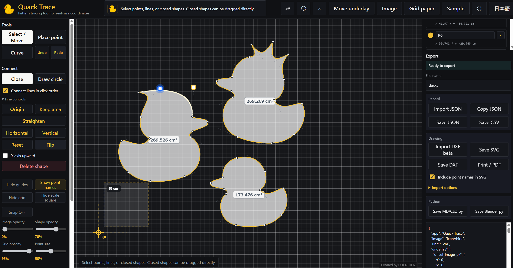
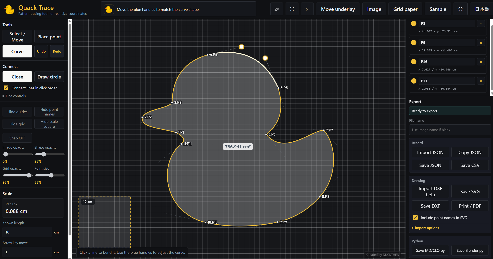
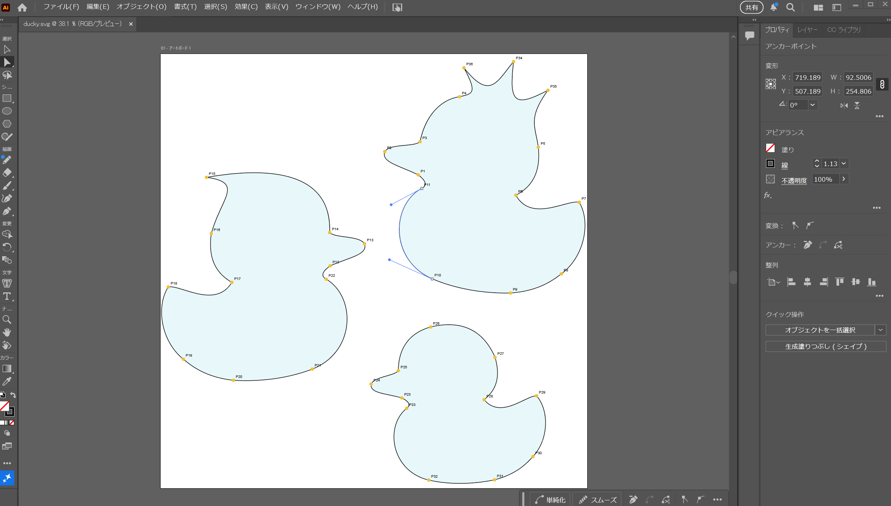
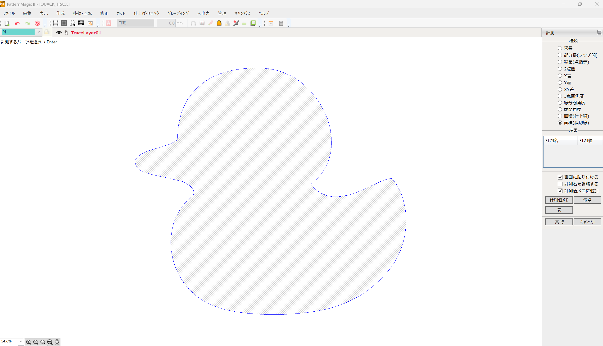
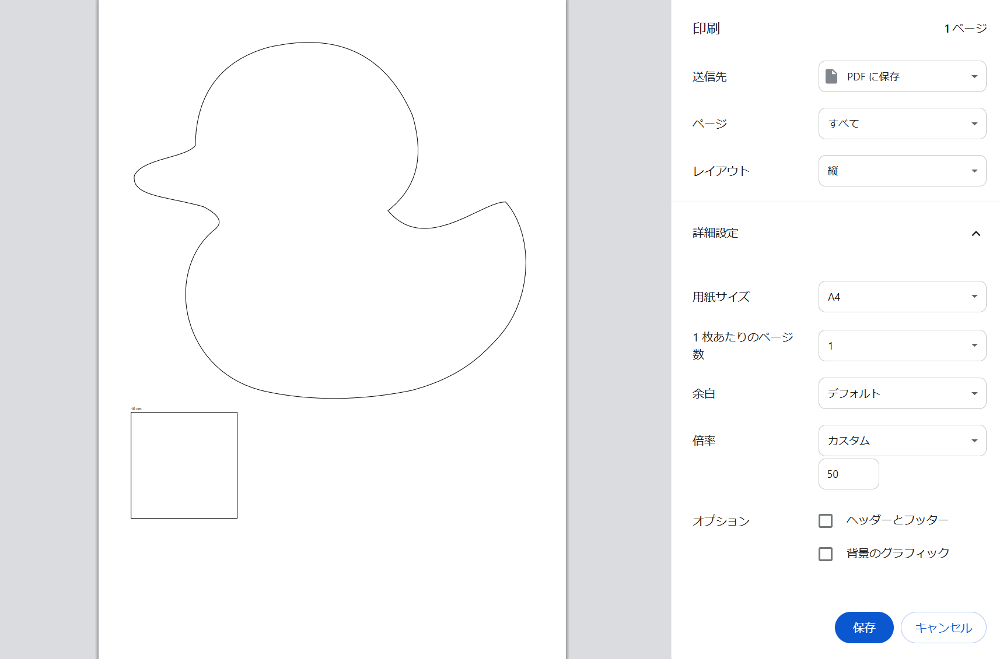

# Quack Trace

Quack Trace is a browser-based pattern tracing tool for making garment shapes from images, grid paper, or quick sketches.

Quack Trace は、画像・方眼紙・簡単なスケッチをもとに、服のパーツ形状を作るためのブラウザ製図トレースツールです。

https://duckthen.github.io/quack-trace/

## Screenshots / スクリーンショット

Main editor with duck-shaped patterns:



Quack Trace editor:



SVG curve check in Illustrator:



CAD import check:



Print / PDF preview:



## Why I Made It / 作った理由

Illustrator, CLO 3D, Marvelous Designer, apparel CAD tools, PDFs, and hand-drawn references are all useful. But moving pattern ideas back and forth between them can get awkward. Quack Trace is a practical experiment: a small tool for shaping clothing patterns more directly, visually, and playfully.

Illustrator、CLO 3D、Marvelous Designer、アパレルCAD、PDF、手描き資料はどれも便利です。ただ、服の形を考えるときに、それぞれのツールを行き来するのは少し大変です。Quack Trace は、服の形をもっと感覚的に、面白く、でも実用的に作れるようにしたくて作った小さな実験ツールです。

## Features / できること

- Load images as tracing underlays.
- 画像を下敷きとして読み込めます。
- Use built-in grid paper for real-size tracing.
- 実寸確認用の方眼紙を使えます。
- Set a real-world scale from a known length.
- 既知の長さから実寸スケールを設定できます。
- Place points, connect lines, bend curves, and close shapes.
- 点を置き、線でつなぎ、カーブにし、閉じた図形を作れます。
- Draw real circle shapes.
- 図形としての円を描けます。
- Add sketch pencil lines and sketch circles that do not affect exports.
- 出力に入らない下書きペン・下書き円を使えます。
- Move only the underlay without moving traced points, lines, origin, or scale reference.
- 点・線・原点・スケール四角を固定したまま、下敷きだけを動かせます。
- Pan the view without changing coordinates.
- 座標を変えずに、視界だけを移動できます。
- Hide point labels when the screen gets crowded.
- 点が密集したときは、画面上のポイント番号を非表示にできます。
- Save and restore work with JSON.
- JSONで作業途中を保存・再読み込みできます。
- Export SVG, CSV, DXF, MD/CLO Python, Blender Python, and print/PDF output.
- SVG、CSV、DXF、MD/CLO向けPython、Blender向けPython、印刷/PDFを書き出せます。
- Switch between Japanese and English UI.
- 日本語UIと英語UIを切り替えられます。

## Keep Area Mode / 面積を保つモード

There is a hidden-favorite feature: Keep Area. When it is on, you can reshape a closed pattern while trying to preserve its area. Garment parts can feel very different after a small outline change, so this mode is fun for exploring shape variations without changing the overall amount too much.

こっそり気に入っている機能として、「面積を保つ」モードがあります。ONにすると、閉じた図形の面積をなるべく変えずに輪郭を動かせます。服のパーツは少し輪郭を変えるだけで印象が変わるので、全体量を大きく変えずに形を試す遊びに向いています。ぜひ触ってみてください。

## Exports / 出力

Quack Trace can export the traced pattern in several formats.

Quack Trace で作った図は、用途に合わせていくつかの形式で書き出せます。

- `JSON`: save and reload the Quack Trace work state.
- `JSON`: Quack Traceで作業を続けるための保存形式です。
- `SVG`: check or edit in Illustrator and other vector tools.
- SVG is the recommended format when you want to keep editable curves in Illustrator.
- `SVG`: Illustratorなどのベクターツールで確認・編集できます。
- `CSV`: export point coordinates.
- `CSV`: 点の座標を表形式で書き出せます。
- `DXF`: test with CAD-oriented workflows.
- `DXF import`: experimental. It is intended for trying CAD-origin DXF outlines inside Quack Trace, not for perfect CAD compatibility. The recommended starting options are: simplify DXF curves as lines, keep DXF point markers, show the original DXF guide, and leave internal lines off.
- `DXF読込`: 実験機能です。CAD由来DXFを完全互換で再現するためではなく、Quack Trace上で外形を読み込み、元DXF線を見ながら手直しするための機能です。最初のおすすめ設定は「DXFカーブを直線化ON」「DXFポイントを保持ON」「元DXF線を表示ON」「DXF内部線も読むOFF」です。
- `DXF`: CAD系ツールでの確認に使えます。
- `MD/CLO py`: create pattern points and lines in Marvelous Designer / CLO 3D.
- `MD/CLO py`: Marvelous Designer / CLO 3D に点や線を作るためのPython出力です。
- `Blender py`: inspect the shape in Blender.
- `Blender py`: Blenderで形を確認するためのPython出力です。
- `Print / PDF`: print a real-size black-line drawing or save it as PDF.
- `印刷 / PDF`: 実寸の黒線図として印刷したり、PDF保存したりできます。

Export behavior is still experimental. Different tools read curves and exported DXF differently, so it is best to test with small shapes first. DXF import and DXF export are both beta features, and should be treated as experimental CAD workflow helpers rather than guaranteed interchange formats.

DXF import is also experimental. For apparel CAD exports, Quack Trace currently works best as a cleanup workspace: import the outline, keep useful CAD point markers, compare against the original DXF guide, then redraw or bend curves by hand where needed. DXF export can be useful for checking the result in CAD tools, but the receiving app may interpret curves and points differently.

DXF読込も実験機能です。アパレルCAD由来のDXFは、現時点では「外形を読み込む」「必要なCADポイントを残す」「元DXFガイドと見比べる」「必要なカーブを手で曲げ直す」ための作業台として使うのが一番安定しています。DXF保存もベータ機能で、CAD側の読み方によってカーブや点の扱いが変わることがあります。

出力まわりはまだ実験中です。ツールごとにカーブや書き出したDXFの読み方が違うので、まずは小さな図形で試すのがおすすめです。

## Important Note / 大事な注意

The mischievous duck next to the title is clickable. If you click it, it quacks and resets the current points, lines, and faces. Please save your work with `JSON Save` often.

タイトル横のイタズラアヒルはクリックできます。押すとアヒルが鳴いて、作図中の点・線・面がリセットされます。作業中はこまめに `JSON保存` してください。

The duck is cute, but it will still erase things.

アヒルはかわいいですが、油断すると消します。

## Try Locally / ローカルで試す

From the repository parent folder, start a local server.

リポジトリの親フォルダで、ローカルサーバーを起動します。

```powershell
python -m http.server 8790 --bind 127.0.0.1
```

Open this URL in a browser.

ブラウザで次のURLを開きます。

```text
http://127.0.0.1:8790/quack-trace/
```

Opening `index.html` directly also works for many workflows, but a local server is closer to the GitHub Pages environment.

`index.html` を直接開いても多くの機能は動きますが、GitHub Pagesに近い状態で見るならローカルサーバーがおすすめです。

## Privacy / プライバシー

Quack Trace runs entirely in the browser as a static HTML/CSS/JavaScript app.

Quack Trace は、静的な HTML/CSS/JavaScript アプリとしてブラウザ内で動きます。

- Loaded images stay in the local browser session.
- 読み込んだ画像は、ローカルのブラウザセッション内に残ります。
- The app does not upload images, JSON, or traced coordinates to a server.
- アプリは画像、JSON、トレース座標をサーバーへアップロードしません。
- Exported files are created locally by the browser.
- 書き出しファイルはブラウザ上でローカルに作成されます。

GitHub Pages hosts the app files, but it does not receive the images you load into the tool.

GitHub Pages はアプリ本体を配信しますが、ユーザーが読み込んだ画像を受け取りません。

See `PRIVACY.md` for the short privacy note.

短いプライバシーメモは `PRIVACY.md` にあります。

## Assets / 素材

The source code is licensed under the MIT License.

ソースコードは MIT License です。

The duck sound effect is a third-party asset from Pixabay and is documented separately in `assets/sounds/README.md`. Do not redistribute or sell the sound as a standalone asset.

アヒルの効果音は Pixabay 由来の第三者素材で、詳細は `assets/sounds/README.md` に記録しています。音声素材単体として再配布・販売しないでください。

## Status / 開発状況

Beta. The app is usable, but the UI and export workflows are still changing.

現在はベータ版です。基本機能は使えますが、UIや出力ワークフローはまだ調整中です。

See `ROADMAP.md` for known improvements and export notes.

今後の改善予定と出力メモは `ROADMAP.md` にあります。

Initial public beta notes are drafted in `RELEASE_NOTES.md`.

初回公開ベータのメモは `RELEASE_NOTES.md` にあります。
